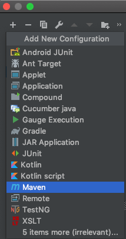
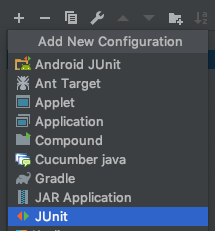

# Table of Contents


# Software Requirements

## IDE
The recommended IDE to run this automation framework is IntelliJ IDEA version 2018

[2018.3.6 for MacOS](https://download.jetbrains.com/idea/ideaIC-2018.3.6.dmg)

> Note: versions newer than 2018 cause conflict with Cucumber plugin 

## Maven
Maven is required to download the dependencies of the project

```bash
brew install maven
```

## ChromeDriver

```bash
brew cask install chromedriver
```

## Plugins

### Gherkin Plugin
Install **Gherking** plugin to IntellIJ from the `Marketplace`

- IntellIJ IDEA > Preferences > Plugins > Marketplace

### Cucumber Plugin
Install **Cucumber for Java** plugin to IntellIJ from the `Marketplace`

-- IntellIJ IDEA > Preferences > Plugins > Marketplace


# IDE Profiles

The IDE needs a couple of profiles in order to run this automation

## Maven Profile

1. In the upper right click in `Add Configuration...`


2. Click on plus icon to `Add New Configuration and select Maven



3. Under `Parameters tab setup the following inputs:

	1. **Working directory**:  `<automation folder absolute path>`
	2. **Command line**:  `clean install`

4. Under `Runner tab setup the following inputs:
	1. **JRE**: `<Java version 1.8>`

## JUnit Profile

1. In the upper right click in `Add Configuration...`


2. Click on `plus` icon to `Add New Configuration` and select `JUnit`



3. Under `Configuration` tab setup the following inputs:
   1. **Name**: `<any name>`
   2. **Class** = com.example.E2ETest
   3. **Working directory**: `<automation folder absolute path>`
   4. **User class path of module**: TestAutomation
   5. **JRE**: `<Java version 1.8>`


# Project Structure

## POM

This file is to used to handle project dependencies. Create a new file called `pom.xml` in the root of the project

The basic `POM` structure is the following:

```xml
<project>

    <modelVersion>4.0.0</modelVersion>
    <groupId>com.mycompany.app</groupId>
    <artifactId>my-app</artifactId>
    <version>1</version>

    <dependencies>
        <dependency>
            <groupId>org.seleniumhq.selenium</groupId>
            <artifactId>selenium-server</artifactId>
            <version>3.141.59</version>
        </dependency>
        <dependency>
            <groupId>org.seleniumhq.selenium</groupId>
            <artifactId>selenium-chrome-driver</artifactId>
            <version>3.141.59</version>
        </dependency>
    </dependencies>

</project>
```

- `project`: this tag is the parent tag

  - `modelVersion`: This tag is needed by the parent tag
  - `groupId`: This tag is needed by the parent tag
  - `artifactId`: This tag is needed by the parent tag
  - `version`: This tag is needed by the parent tag

- `dependencies`: Inside this tag you will have all the project dependencies related

  - `dependency`: Each of one of this tag, mean a dependency that maven will download when compile the project

### Opening the pom.xml with IntellIJ

Open the created file `pom.xml` with IntellIJ:

1. File > Open

2. Select the file `pom.xml`

3. IntellIJ will ask how to open the project, select the option `Open as project`

   

4. In the next window select `Open Existing Project` (if any)

   

5. In the pop-up select `Add as Maven Project`

   


### Running the POM with Maven

1. Select the maven profile created

   

2. Run it

   

3. If eveything is good, the console will show you the following message

   

4. If the step 3 was successful, you will have the dependencies added on IntellIJ


### POM Dependencies from Maven Repository

In order to add more dependencies to the `pom.xml`, go to the official site, find a dependency and grab the pom code from: [Maven Repository](https://mvnrepository.com/)

Example:


# References

## POM

- [Introduction to the pom](https://maven.apache.org/guides/introduction/introduction-to-the-pom.html)