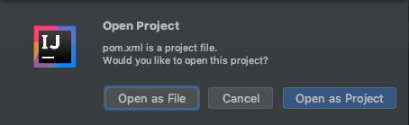
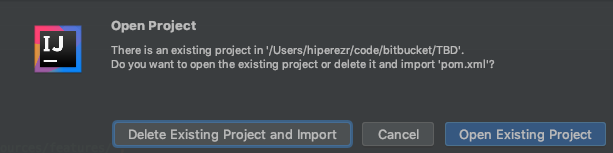
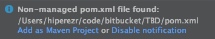
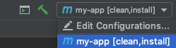
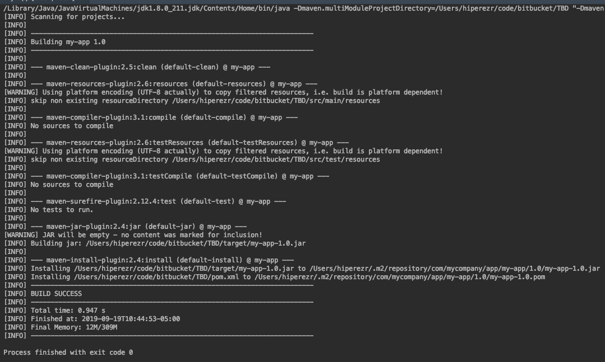
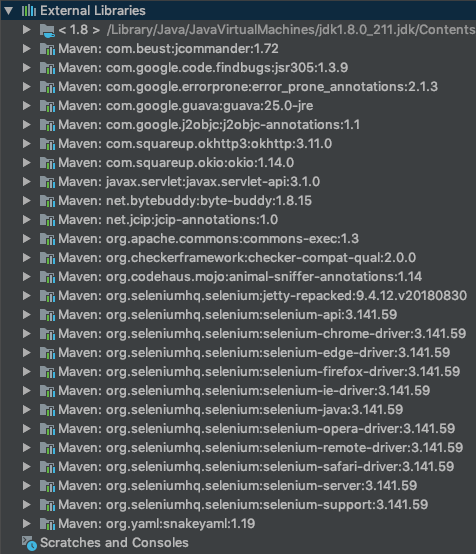
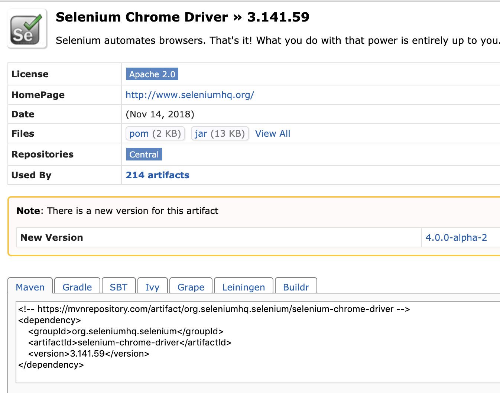

# Table of Contents


# Project Structure

## POM

This file is to used to handle project dependencies. Create a new file called `pom.xml` in the root of the project

The basic `POM` structure is the following:

```xml
<project>

    <modelVersion>4.0.0</modelVersion>
    <groupId>com.mycompany.app</groupId>
    <artifactId>my-app</artifactId>
    <version>1</version>

    <dependencies>
        <dependency>
            <groupId>org.seleniumhq.selenium</groupId>
            <artifactId>selenium-server</artifactId>
            <version>3.141.59</version>
        </dependency>
        <dependency>
            <groupId>org.seleniumhq.selenium</groupId>
            <artifactId>selenium-chrome-driver</artifactId>
            <version>3.141.59</version>
        </dependency>
    </dependencies>

</project>
```

- `project`: this tag is the parent tag

  - `modelVersion`: This tag is needed by the parent tag
  - `groupId`: This tag is needed by the parent tag
  - `artifactId`: This tag is needed by the parent tag
  - `version`: This tag is needed by the parent tag

- `dependencies`: Inside this tag you will have all the project dependencies related

  - `dependency`: Each of one of this tag, mean a dependency that maven will download when compile the project

  

### Opening the pom.xml with IntellIJ

Open the created file `pom.xml` with IntellIJ:

1. File > Open

2. Select the file `pom.xml`

3. IntellIJ will ask how to open the project, select the option `Open as project`

   

4. In the next window select `Open Existing Project` (if any)

   

5. In the pop-up select `Add as Maven Project`

   

### POM Setup

1. Open IntellIJ and Add a new configuration


2. Click on the Plus Icon and select Maven

   

3. Under `Parameters` tab set the following options

   1. `Working directory`: the root of the project
   2. `Command line`: clean install

4. Under `Runner` tab set the following option:

   1. `JRE`: Use Project JDK

4. Save the configuration clicking on the `Apply` button and then in `OK` button


### Running the POM with Maven

1. Select the maven profile created

   

2. Run it

   

3. If eveything is good, the console will show you the following message

   

4. If the step 3 was successful, you will have the dependencies added on IntellIJ



### Maven Repository

In order to add more dependencies to the `pom.xml`, go to the official site, find a dependency and grab the pom code from: [Maven Repository](https://mvnrepository.com/)

Example:

